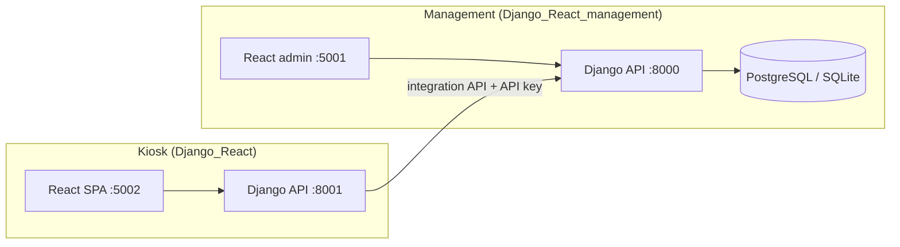

# CustomerClub — project documentation

## Overview

The system splits **business data** (products, branches, offers, end users) on the **management server** from the **kiosk server**, which serves the in-store touchscreen experience.



With `STATELESS_KIOSK=true` (default), the kiosk does not store catalog or user business rows locally; it calls management integration endpoints and caches responses in memory.

## Prerequisites

- **Python** 3.11+ (management repo uses 3.12 in `start-all-dev.cmd`)
- **Node.js** 18+ and npm
- **PostgreSQL** 14+ (production; optional locally)
- Windows: `pg_dump` / `psql` on PATH for backup scripts (optional)

## Installation

### 1. Management backend

```bash
cd Django_React_management/backend
python -m venv ../.venv3.12
# Windows: ..\.venv3.12\Scripts\activate
pip install -r requirements.txt
cp .env.example .env
python manage.py migrate
python manage.py createsuperuser
python manage.py runserver 8000
```

### 2. Management frontend

```bash
cd Django_React_management/frontend
npm install
npm run dev
```

SPA: http://127.0.0.1:5001/

### 3. Kiosk backend

```bash
cd Django_React/backend
python -m venv ../.venv
# Windows: ..\.venv\Scripts\activate
pip install -r requirements.txt
cp .env.example .env
# Set MANAGEMENT_SERVICE_API_KEY same as management .env
python manage.py migrate
python manage.py runserver 8001
```

### 4. Kiosk frontend

```bash
cd Django_React/frontend
npm install
npm run dev
```

SPA: http://127.0.0.1:5002/

### All-in-one (Windows)

From the repo root:

```bat
start-all-dev.cmd
```

## Environment variables

| Variable | Where | Purpose |
|----------|--------|---------|
| `MANAGEMENT_SERVICE_API_KEY` | Both backends | Shared secret for kiosk → management integration |
| `MANAGEMENT_API_BASE_URL` | Kiosk | Management API root (default `http://127.0.0.1:8000`) |
| `STATELESS_KIOSK` | Kiosk | When `true`, no local business DB mirror (default) |
| `ENABLE_OPENAPI` | Kiosk | When `true`, loads drf-spectacular and `/api/v1/schema/` |
| `USE_POSTGRES` / `USE_SQLITE` | Both | Override DB engine (see [DATABASE.md](DATABASE.md)) |
| `DJANGO_DEBUG` / `DEBUG` | Respective `.env` | `True` → SQLite by default |

Never commit `.env` files. Use `.env.example` as templates.

## Integration API (management)

Authenticated with header `Authorization: Bearer <MANAGEMENT_SERVICE_API_KEY>` (see `module_api` integration views). Used by the kiosk for shops, catalog, offers, end-user registration, and redemption sync.

Bulk seeding from `Dataset/` is documented in [../scripts/README.md](../scripts/README.md).

## Kiosk user flows

1. **Landing** → register or login (SMS OTP and/or NFC on login/register screens).
2. **Products / offers** — browse special offers, build cart, redeem points.
3. **Finalize** — submit offer use; score updates via management.

NFC tag management is available from **login/registration** flows, not from the products screen.

## Performance and startup

The kiosk API historically booted slower than management because it always imported **drf-spectacular** and ran full system checks.

Optimizations (kiosk `Django_React/backend`):

| Setting / behaviour | Effect |
|---------------------|--------|
| `ENABLE_OPENAPI=false` (default) | Skips spectacular app and schema routes |
| `manage.py runserver` | Appends `--skip-checks` in dev |
| `start-all-dev.cmd` | Passes `--skip-checks` explicitly |
| PostgreSQL `connect_timeout=2` when `DEBUG=True` | Fails fast if Postgres is unreachable |
| Reduced `LOGGING` in `DEBUG` | Less console I/O on boot |

To generate OpenAPI locally:

```env
ENABLE_OPENAPI=true
```

Then open http://127.0.0.1:8001/api/v1/schema/swagger/

For production, use a WSGI server (gunicorn/uvicorn + workers), `DEBUG=False`, PostgreSQL, and Redis for cache if you run multiple kiosk workers.

## NFC hardware (optional)

See [../Django_React/README.md](../Django_React/README.md) and [../Django_React/docs/NFC_LOGIN.md](../Django_React/docs/NFC_LOGIN.md). Optional Python deps: `Django_React/docs/requirements-nfc.txt`.

## Testing

- Kiosk API checklist: `Django_React/docs/TESTING_CHECKLIST.md`
- Management: use Django admin and the staff SPA after `createsuperuser`

## Troubleshooting

| Symptom | Check |
|---------|--------|
| Kiosk shows no shops/products | Management running? `MANAGEMENT_SERVICE_API_KEY` match? |
| Slow kiosk `runserver` | `USE_POSTGRES=1` without Postgres → use SQLite or start Postgres; keep `ENABLE_OPENAPI=false` |
| CORS errors | Dev: `CORS_ORIGIN_ALLOW_ALL` on kiosk; prod: set allowed origins |
| SMS not sent | `SMS_IR_ENABLED`, provider keys in kiosk `.env` |

## License / ownership

Internal Aras / Customer Club project. Contact your team lead for deployment credentials and production hosts.
